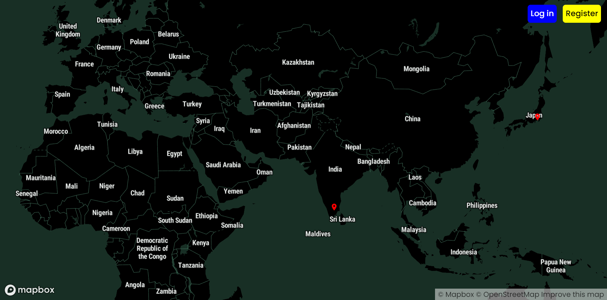
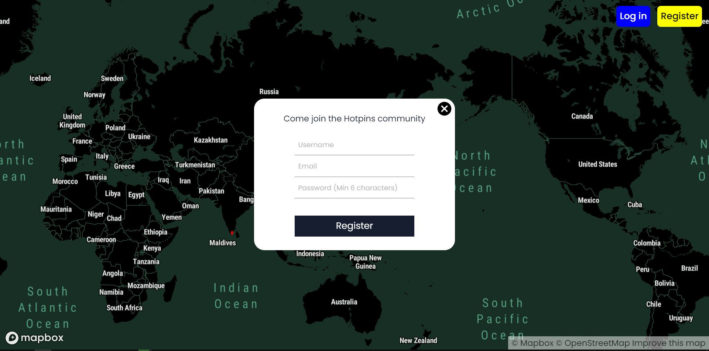
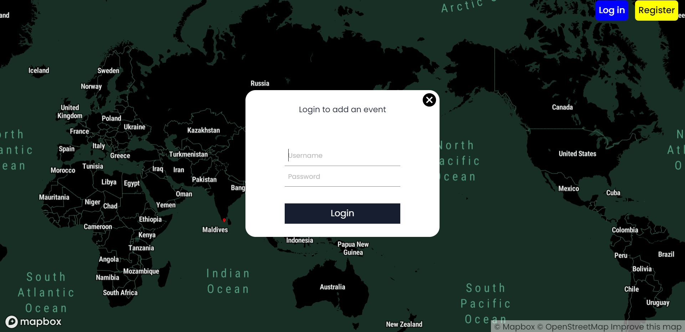
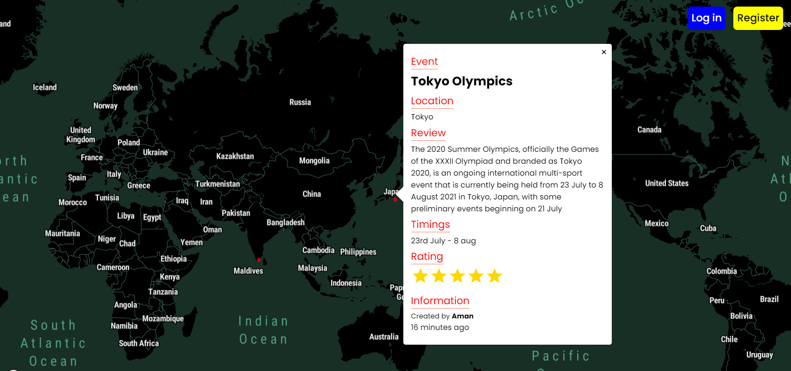
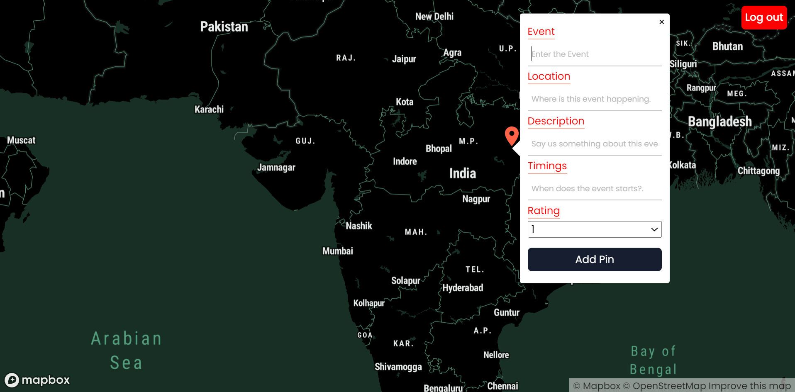
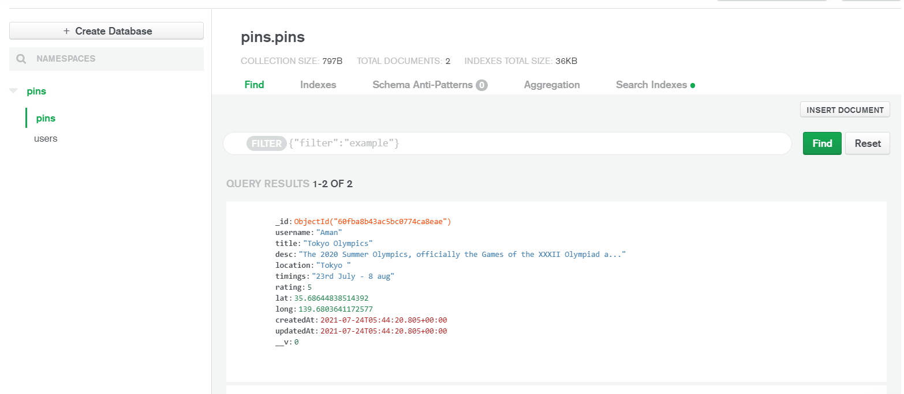
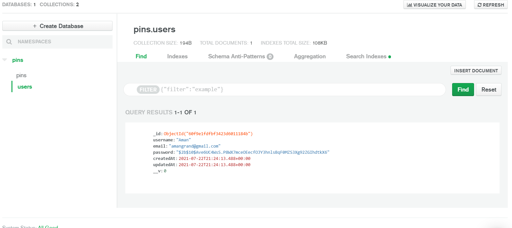

# HotPins
A real-time Mern stack application built on Mapbox API. The application allows users to find the trendiest events happening around them. Users can also create event pins to add an event .

## All hot events happening will be marked with red location pins

## Register and login to add an event

Select a username, password, email to register.

Enter the login details to start contributing.

## View All hot events happening around you

## Create an event 

## Datastore of the application
 Mongo Db atlas is used for storing the information. The cluster consists of two types of document models.
 
 ### Pins document model - To store information about an event
 

 ### Users document model - To store information about a user
 
 
 
 ## Want to change anything? Feel free to raise an issue
